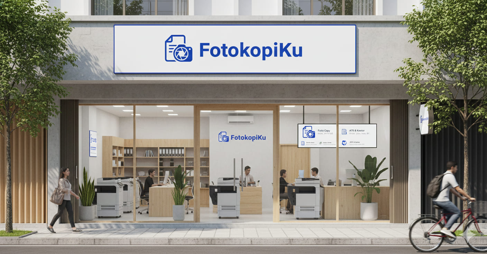
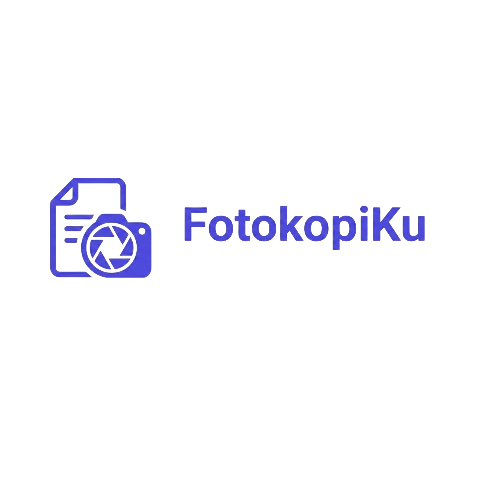

# 🖨️ FotokopiKu - Panduan Setup Proyek

> Website fotokopi online modern & responsive untuk layanan print, fotokopi, ATK, dan lebih banyak lagi! ✨

---

## 🎯 Apa Itu FotokopiKu?

Platform e-commerce digital untuk layanan fotokopi dengan fitur lengkap:
- 🛒 Keranjang belanja dengan kontrol qty real-time
- 💳 Pembayaran COD & QRIS dengan bukti transfer
- 📦 Tracking pesanan otomatis
- 🚚 Pengiriman Jabodetabek dengan ongkir otomatis
- 📊 Dashboard admin untuk kelola pesanan & produk
- 📱 **100% responsive** - mobile, tablet, desktop

---

## 📥 Yang Perlu Didownload

Jika kamu download folder ini di komputer lain, install software berikut:

### 1️⃣ **Laragon Full** (Windows) ⭐ Recommended
📥 Download: [laragon.org/download](https://laragon.org/download/)
- **Versi:** Laragon Full 6.0+
- **Kenapa?** Sudah include **PHP 8.1**, **MySQL 5.7**, **Composer**, dan terminal
- **Alternatif Mac/Linux:** XAMPP atau MAMP

### 2️⃣ **PHP 8.1+** 
📌 **Versi:** PHP 8.1.10 atau lebih baru
- **Kenapa?** Laravel 10 butuh PHP 8.1 minimum
- **Cek:** `php -v` di terminal
- **Sudah include di Laragon**

### 3️⃣ **Composer 2.x**
📥 Download: [getcomposer.org](https://getcomposer.org/)
- **Versi:** Composer 2.0+
- **Kenapa?** Package manager untuk install dependencies Laravel
- **Cek:** `composer -v`
- **Sudah include di Laragon**

### 4️⃣ **Node.js 18+ (LTS)**
📥 Download: [nodejs.org](https://nodejs.org/)
- **Versi:** Node.js 18.x atau 20.x LTS
- **Kenapa?** Compile CSS/JS dengan Vite 5.0
- **Cek:** `node -v` dan `npm -v`

### 5️⃣ **MySQL 5.7+**
📌 **Versi:** MySQL 5.7 atau MariaDB 10.3+
- **Kenapa?** Database untuk simpan semua data
- **Sudah include di Laragon**

---

## 🚀 Setup di Komputer Baru (5 Menit!)

### Step 1: Extract Folder
```
C:\laragon\www\fotokopi1
```
Atau `htdocs/fotokopi1` kalau pakai XAMPP.

### Step 2: Install Dependencies
Buka terminal di folder proyek:
```bash
composer install    # Install Laravel packages
npm install        # Install frontend packages
```

### Step 3: Setup Environment
```bash
copy .env.example .env      # Buat file config
php artisan key:generate    # Generate app key
```

### Step 4: Konfigurasi Database
Edit file `.env`:
```env
DB_CONNECTION=mysql
DB_HOST=127.0.0.1
DB_PORT=3306
DB_DATABASE=fotokopi_db
DB_USERNAME=root
DB_PASSWORD=
```

### Step 5: Buat Database & Migrasi
1. Buka **phpMyAdmin** (localhost/phpmyadmin)
2. Buat database baru: `fotokopi_db`
3. Jalankan migrasi:
```bash
php artisan migrate          # Buat tabel
php artisan db:seed          # Isi data dummy (opsional)
php artisan storage:link     # Link storage untuk upload
```

### Step 6: Jalankan Server
Buka 2 terminal:
```bash
# Terminal 1 - Backend
php artisan serve

# Terminal 2 - Frontend (hot reload)
npm run dev
```

Buka browser: `http://localhost:8000` 🎉

---

## 🔐 Akun Default (Setelah Seeding)

| Role | Email | Password |
|------|-------|----------|
| Admin | admin@fotokopi.com | password |
| User | user@fotokopi.com | password |

---

## 📦 Versi Akurat

### Backend (composer.json)
- **Laravel:** 10.50.0 (`laravel/framework` ^10.10)
- **PHP:** 8.1.10+ minimum
- **PDF Generator:** barryvdh/laravel-dompdf ^3.1
- **Auth:** laravel/sanctum ^3.3

### Frontend (package.json)
- **Vite:** 5.0.0 (build tool super cepat)
- **Tailwind CSS:** 3.4.19 (styling responsive)
- **Alpine.js:** 3.14.3 (interaktivitas ringan)
- **Axios:** 1.6.4 (HTTP client)

### Database
- **MySQL:** 5.7+ atau **MariaDB:** 10.3+

---

## 💾 Jaga Data Agar Tidak Hilang

### ⚠️ PENTING - Jangan Lakukan Ini di Production:
```bash
# JANGAN jalankan command ini kalau sudah ada data penting:
php artisan migrate:fresh   # ❌ Hapus semua tabel!
php artisan db:wipe        # ❌ Hapus database!
```

### ✅ Yang Aman:
```bash
php artisan migrate        # ✅ Update tabel tanpa hapus data
php artisan storage:link   # ✅ Link storage
```

### 📂 Folder Penting yang Harus Di-backup:
- `storage/app/public/` - Bukti transfer, file upload
- `public/images/` - Gambar produk
- **Database** `fotokopi_db` - Semua data (export via phpMyAdmin)

### 💾 Cara Backup Manual:
1. **Database:** phpMyAdmin → Export → SQL format
2. **Files:** Copy folder `storage/app/public/` dan `public/images/`
3. **Config:** Backup file `.env`

---

## 🛠️ Troubleshooting

| Problem | Solusi |
|---------|--------|
| CSS/JS tidak muncul | `npm run dev` atau `npm run build` |
| Gambar tidak tampil | `php artisan storage:link` |
| Error "No application key" | `php artisan key:generate` |
| Database connection error | Cek `.env` dan pastikan MySQL running |
| Port 8000 sudah dipakai | `php artisan serve --port=8080` |

---

## 🎨 Fitur Responsive

Website ini **100% responsive** di semua perangkat:
- 📱 Mobile (320px - 640px): Single column, stacked
- 💻 Tablet (640px - 1024px): 2-3 columns
- 🖥️ Desktop (1024px+): 4 columns

**Breakpoints Tailwind:**
- `sm:` 640px+ (tablet)
- `md:` 768px+ (tablet landscape)
- `lg:` 1024px+ (desktop)

**Halaman yang Sudah Responsive:**
- ✅ Catalog (home page) - 2 col mobile → 4 col desktop
- ✅ Cart - stacked on mobile, row on tablet+
- ✅ Checkout - full-width buttons mobile, auto on tablet+
- ✅ Orders - adaptive card layout
- ✅ Admin Dashboard - responsive stats grid
- ✅ All auth pages (login, register)

---

## 📚 Dokumentasi

- Laravel 10: [laravel.com/docs/10.x](https://laravel.com/docs/10.x)
- Tailwind CSS: [tailwindcss.com](https://tailwindcss.com/docs)
- Vite: [vitejs.dev](https://vitejs.dev/guide/)

---

## 🎯 Kenapa Teknologi Ini?

| Tech | Kenapa Dipakai |
|------|----------------|
| **Laravel 10** | Framework PHP terpopuler, dokumentasi lengkap, komunitas besar |
| **Tailwind CSS** | Styling cepat tanpa ribet, responsive by default |
| **Alpine.js** | Interaktivitas ringan (16kb), alternatif Vue/React untuk simple apps |
| **Vite** | Build super cepat (3-5x lebih cepat dari Webpack), hot reload instant |
| **MySQL** | Database reliable, kompatibel dengan hosting mana pun |

---

## 🚀 Deploy Production

```bash
# Build assets untuk production
npm run build

# Optimize Laravel
php artisan config:cache
php artisan route:cache
php artisan view:cache

# Edit .env
APP_ENV=production
APP_DEBUG=false
```

---

---

## 📸 Foto Toko FotokopiKu menggunakan Gemini AI

### 🏪 Toko Offline 


### 📷 Branding Logo



---

## 👥 Tim & Pengguna

### Staff (Siap melayani cepat)
- Jessie, Tasya, Nadela, Sulis, Eka

### Pengguna Aktif (Beta Tester & Customer)
- Olivia, Eliana, Aurora, Amelia, Eleanor, Luna, Zairee, Selina, Quinlyn, Kayesha, Naura, Callysta
- Noah, Leo, Luca, Zayn, Arka, Elio, Kael, Ezra, Ravi, Kenzo, Raka, Nara, Dio, Arya, Fino, Lio, Rafi, Druv, Lian

Singkat dan jelas: tim inti memastikan operasional, sementara daftar pengguna adalah tester dan customer awal yang membantu validasi fitur dan responsivitas. 🙌

---

## 🏪 Kenapa FotokopiKu Dibuat?

Website ini dirancang berdasarkan observasi langsung di toko fotokopi nyata untuk mengatasi masalah berikut:

**Problem Customer:**
- ⏰ **Antrian Panjang** – Saat ramai, harus menunggu lama
- 💰 **Harga Tidak Jelas** – Harga sering tidak transparan
- 🚚 **Pengiriman Manual** – Harus ambil sendiri atau nego ongkir

**Problem Owner:**
- 📝 **Order Manual** – Catat pesanan di buku, rawan salah
- 📦 **Stok Tidak Terpantau** – Stok sering kosong mendadak
- 💵 **Pembayaran Ribet** – Customer lupa bayar atau tidak bawa uang

**Solusi FotokopiKu:**
- ✅ **Order Online** – Pesan kapan saja tanpa antri
- ✅ **Harga Transparan** – Semua harga jelas di website
- ✅ **Ongkir Otomatis** – Sistem hitung ongkir berdasarkan kota
- ✅ **Payment Fleksibel** – Bayar di tempat atau QRIS dengan bukti transfer
- ✅ **Tracking Real-time** – Customer tahu status pesanan
- ✅ **Admin Panel** – Kelola stok & pesanan dengan mudah

---

## 🙏 Terima Kasih!

Semoga panduan ini membantu setup FotokopiKu di komputer lain. Happy coding! 🎉

**Tips:** Selalu backup data sebelum update dependency atau migrasi!
